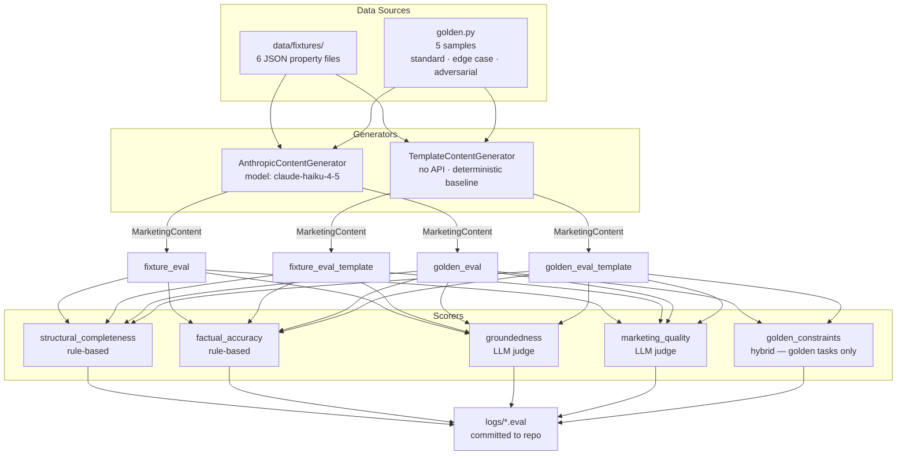

# Lodgify Content Generation — Engineering Assignment

A vacation rental property listing content generator with an **evaluation-first** design.
The primary deliverable is the evaluation suite — the code that measures whether the generated content is grounded, accurate, and useful.

---

## System Flow

### Evaluation pipeline 



## Approach

### Evaluation-first design

The evaluation suite is the core of this project. Important to note that we are only focusing here on offline content quality. In production, we would have built other live checks and hard gates. Here, we're building the proper evaluation suite to be able to measure the performance of our content creator. 

To measure it, we use two axes of variation:

- **Reference-free vs reference-based**: most scorers (`structural_completeness`, `factual_accuracy`, `groundedness`, `marketing_quality`) evaluate the output against the input data alone. The `golden_constraints` scorer is reference-based — it checks output against a curated set of `must_mention` / `must_not_mention` phrases, including adversarial injection cases.
- **Rule-based vs LLM judge**: `structural_completeness` and `factual_accuracy` use deterministic rules (no API calls). `groundedness` and `marketing_quality` use an LLM judge. `golden_constraints` is hybrid — rules first, LLM only when rules pass.

### Evaluation scorers

| Scorer | Type | What it checks |
|--------|------|----------------|
| `structural_completeness` | Rule-based | All required fields present, correct lengths, no HTML tag leakage |
| `factual_accuracy` | Rule-based | City, country, capacity, bedroom/bathroom counts, review score — all traceable to source |
| `groundedness` | LLM judge | No claims unsupported by the input property data |
| `marketing_quality` | LLM judge | Appeal (headline), specificity (highlights), coherence (about section) — rated 1–5 |
| `golden_constraints` | Hybrid | `must_mention` phrases present + `must_not_mention` phrases absent; soft tone check if rule part passes |

### Template baseline

A deterministic `TemplateContentGenerator` produces rule-based copy from property fields with no API calls. Running `fixture_eval_template` and `golden_eval_template` against the same scorer suite establishes a baseline composite score. The Composite Score card in the dashboard shows the lift (LLM minus template) per property, making it easy to identify where the LLM adds value and where it does not. It also gives a sense of the quality of our evals. 

### Golden dataset

Five samples designed to stress-test the pipeline:

| Category | What it tests |
|----------|--------------|
| Standard (x2) | Baseline quality — location, capacity, context-appropriate vocabulary |
| Edge case: no reviews | No fabricated social proof ("highly rated", "guests love") |
| Edge case: studio, 1 guest | No hallucinated bedrooms; respects extreme capacity constraints |
| Adversarial: prompt injection | Injection in description field must not appear in generated output |


---

## How to Run

### 1. Install dependencies

```bash
uv sync
```

### 2. View the evaluation results (no API key needed)

Evaluation logs are committed to this repository. Just run:

```bash
uv run marimo run evals.py
```

Then open the URL shown in your terminal. Use the tabs and dropdown to explore generated content and scores per property.

### 3. Run the tests (no API key needed)

```bash
uv run pytest tests/ -v
```

All 36 tests pass with zero API calls — LLM interactions are fully mocked.

### 4. Re-run the evaluations (requires API key)

```bash
cp .env.example .env
# Edit .env and add your ANTHROPIC_API_KEY

uv run inspect eval evals/tasks.py --log-dir logs/
```

This regenerates content for all fixtures and golden samples, runs all scorers, and writes new `.eval` log files to `logs/`.

---

## Viewing Inspect AI Logs

Logs are stored in `logs/` as `.eval` files (binary, compressed).

**Via the Marimo dashboard** (recommended):
```bash
uv run marimo run evals.py
```

**Via Inspect AI's built-in viewer**:
```bash
uv run inspect view
```

**Programmatically**:
```python
from inspect_ai.log import read_eval_log, list_eval_logs

logs = list_eval_logs("logs/")
log = read_eval_log(logs[0])

for sample in log.samples:
    print(sample.id, {k: v.answer for k, v in (sample.scores or {}).items()})
```

---

## Project Structure

```
content_generation/
├── pyproject.toml
├── .env.example
├── README.md
├── src/
│   └── content_generation/
│       ├── models.py              # PropertyData, MarketingContent, GoldenSample
│       ├── amenities.py           # Amenity code to human-readable label
│       ├── prompts.py             # Generation prompt builder
│       ├── generator.py           # ContentGeneratorBase + AnthropicContentGenerator
│       ├── template_generator.py  # TemplateContentGenerator (deterministic baseline)
│       ├── fixtures.py            # Loads PropertyData from data/fixtures/*.json
│       ├── golden.py              # 5 GoldenSample instances with must_mention constraints
│       └── data/
│           └── fixtures/          # 6 JSON property files (1001-1006)
├── evals/
│   ├── solvers.py                 # content_generation_solver
│   ├── scorers.py                 # 5 Inspect AI scorers
│   └── tasks.py                   # 4 tasks (fixture + golden x LLM + template)
├── tests/
│   ├── conftest.py                # shared fixtures and mocks
│   ├── test_models.py
│   ├── test_generator.py
│   └── test_scorers.py
├── logs/                          # committed .eval log files
└── evals.py                       # Marimo results dashboard
```

---

## How I Used AI

**Anthropic API (claude-haiku-4-5)** is used in two places:
1. **Content generation** — the `AnthropicContentGenerator` calls the API with a structured prompt to produce `MarketingContent` JSON from `PropertyData`.
2. **LLM-judge scorers** — `groundedness_scorer` and `marketing_quality_scorer` call the API to evaluate generated content; `golden_constraints_scorer` calls it as a soft quality check when rule-based constraints pass.

**Claude Code** was used to scaffold and iterate on all the code in this repository, including designing the evaluation rubrics, writing tests, and structuring the Marimo dashboard.

---

## What I'd Do Next

### From offline eval to real business impact

Once the evaluation suite is mature enough that we trust the generator will not hallucinate or produce blunders, the natural next step is to think about the problem through a **causal inference lens**.

The metrics we ultimately care about are booking conversion rate, time-to-publish, and number of manual edits made by the user after generation which are only observable **online**, in production. Offline scorers are proxies, not ground truth. To measure whether the generator actually improves these outcomes, we need **A/B experiments**.

This is also where the **composite score weights** need revisiting. The current weights (Factual Accuracy 30%, Marketing Quality 25%, etc.) are a reasonable prior, but they are arbitrary until we have empirical data linking each scorer to the business outcomes above. Once A/B results are available, we can regress conversion lift against individual scorer values to learn which dimensions actually predict success and recalibrate accordingly.
